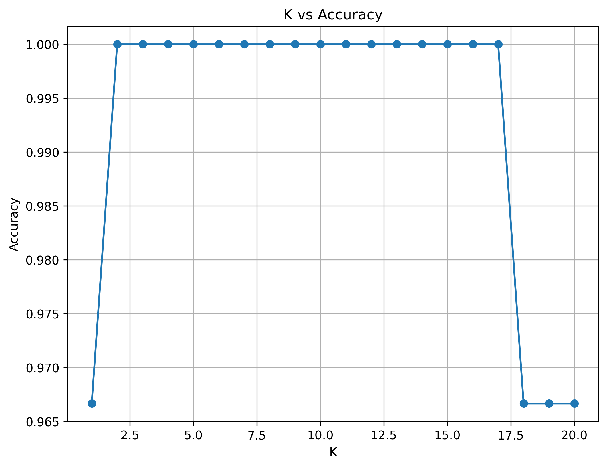
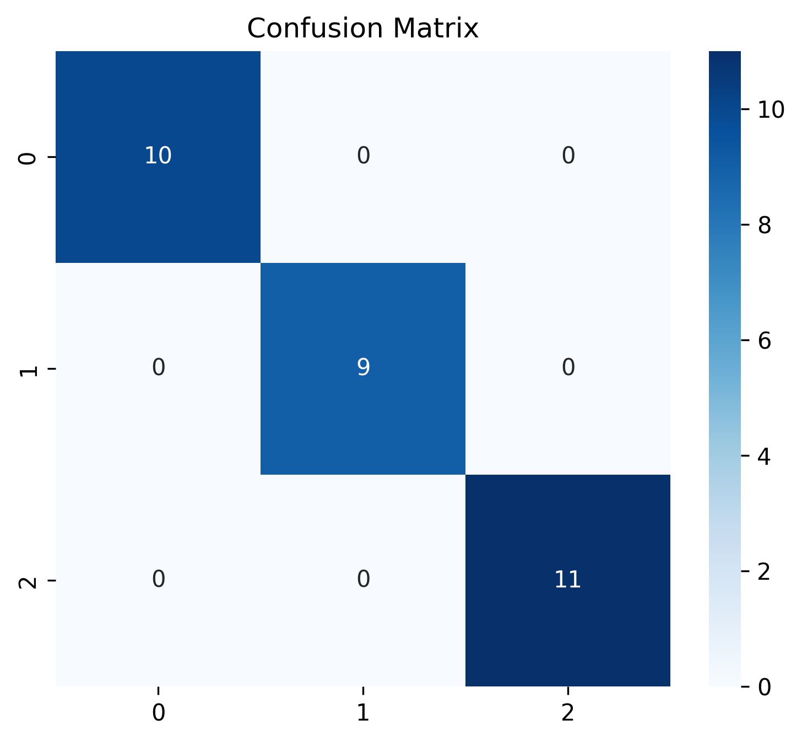
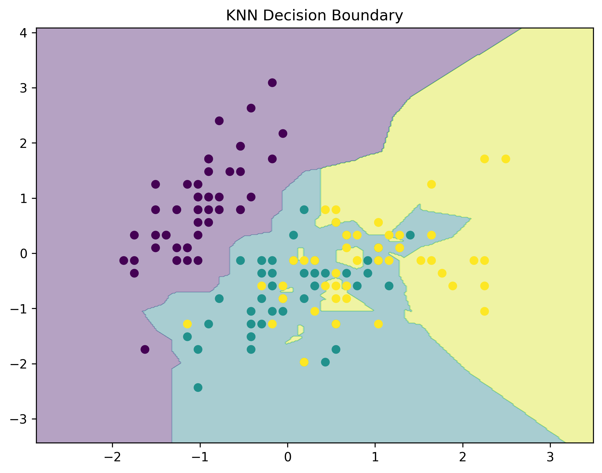

# ElevateLabs-Task6
# 🤖 Iris Classification using K-Nearest Neighbors (KNN)


---

## 📌 Project Overview

This project implements the **K-Nearest Neighbors (KNN)** algorithm for classification using the famous **Iris Dataset**.

KNN is a simple yet powerful supervised machine learning algorithm that classifies data points based on the majority class of their nearest neighbors.

The project explores the effect of different values of **K**, evaluates model performance using classification metrics, and visualizes the decision boundaries learned by the model.

---

## 🎯 Objectives

- Understand the K-Nearest Neighbors algorithm
- Normalize feature values
- Train a KNN classifier
- Experiment with different values of K
- Evaluate model performance
- Visualize decision boundaries
- Analyze classification results

---

## 🛠️ Tech Stack

| Tool | Purpose |
|--------|---------|
| Python | Programming Language |
| Pandas | Data Manipulation |
| NumPy | Numerical Computing |
| Matplotlib | Visualization |
| Seaborn | Statistical Visualization |
| Scikit-Learn | Machine Learning |

---

## 📂 Dataset

### Iris Dataset

The Iris dataset contains measurements of iris flowers from three different species.

Features:

- Sepal Length
- Sepal Width
- Petal Length
- Petal Width

Target Classes:

| Class |
|---------|
| Iris Setosa |
| Iris Versicolor |
| Iris Virginica |

The dataset contains:

```text
150 Samples
4 Features
3 Classes
```

---

## 🔍 Project Workflow

### 1️⃣ Data Loading

The Iris dataset was loaded and converted into a Pandas DataFrame.

```python
iris = load_iris()
```

---

### 2️⃣ Feature Scaling

Since KNN relies on distance calculations, feature scaling was applied using StandardScaler.

```python
scaler = StandardScaler()
X_scaled = scaler.fit_transform(X)
```

### Why Scaling?

Without scaling:

- Features with larger values dominate distance calculations.
- Model performance may degrade.

Scaling ensures all features contribute equally.

---

### 3️⃣ Train-Test Split

The dataset was divided into:

- 80% Training Data
- 20% Testing Data

```python
train_test_split(
    X_scaled,
    y,
    test_size=0.2,
    random_state=42
)
```

---

## 🤖 K-Nearest Neighbors Classifier

The KNN algorithm classifies a sample by examining the classes of its nearest neighbors.

### How KNN Works

1. Calculate distances to all training points.
2. Select the K nearest neighbors.
3. Perform majority voting.
4. Assign the most common class.

---

## 📊 Choosing the Best K

Multiple K values were tested to identify the optimal number of neighbors.

### K vs Accuracy

<p align="center">
  
</p>

### Observation

- Small K values may overfit.
- Large K values may underfit.
- The optimal K provides the highest testing accuracy.

---

## 📈 Model Performance

The model was evaluated using accuracy and confusion matrix analysis.

### Accuracy

The final KNN model achieved high classification accuracy on the test dataset.

The exact results can be found in:

```text
metrics.csv
```

---

## 📋 Confusion Matrix

A confusion matrix was generated to analyze prediction performance.

<p align="center">
  
</p>

### Interpretation

The confusion matrix shows:

- Correct classifications
- Misclassifications
- Class-wise prediction performance

A strong diagonal indicates good classification accuracy.

---

## 🌈 Decision Boundary Visualization

To visualize how KNN separates classes, a decision boundary was created using two selected features.

<p align="center">
  
</p>

### Observation

- Different regions represent predicted classes.
- Boundaries are determined by neighboring samples.
- KNN produces non-linear decision boundaries.

---

## 📊 Classification Report

The model was evaluated using:

- Precision
- Recall
- F1-Score

These metrics provide deeper insight into classification performance beyond accuracy.

---

## 📁 Project Structure

```text
ElevateLabs-Task6/
│
├── data/
│   └── Iris.csv
│
├── images/
│   ├── confusion_matrix.png
│   ├── decision_boundary.png
│   └── k_vs_accuracy.png
│
├── metrics.csv
│
├── knn_classification.ipynb
│
└── README.md
```

---

## 🚀 Getting Started

### Clone Repository

```bash
git clone https://github.com/your-username/ElevateLabs-Task6.git
```

### Navigate to Project

```bash
cd ElevateLabs-Task6
```

### Install Dependencies

```bash
pip install pandas numpy matplotlib seaborn scikit-learn
```

### Run Notebook

```bash
jupyter notebook
```

Open:

```text
knn_classification.ipynb
```

---

## 📈 Key Findings

- Feature scaling is essential for KNN performance.
- The choice of K significantly affects accuracy.
- KNN performs well on the Iris dataset.
- Decision boundaries are influenced by neighboring samples.
- Proper K selection helps balance bias and variance.

---

## 🎓 Learning Outcomes

Through this project, I learned:

- K-Nearest Neighbors Algorithm
- Distance-Based Learning
- Feature Normalization
- Hyperparameter Tuning (K Selection)
- Confusion Matrix Analysis
- Classification Metrics
- Decision Boundary Visualization
- Multi-Class Classification

---

## 🔮 Future Improvements

- Hyperparameter Optimization
- Weighted KNN
- Cross Validation
- Compare with Logistic Regression
- Compare with Decision Trees and Random Forests
- Apply KNN to larger real-world datasets

---

## 👨‍💻 Author

**Pushkar Agrawal**

B.Tech CSE Student | Machine Learning Enthusiast | AI Learner